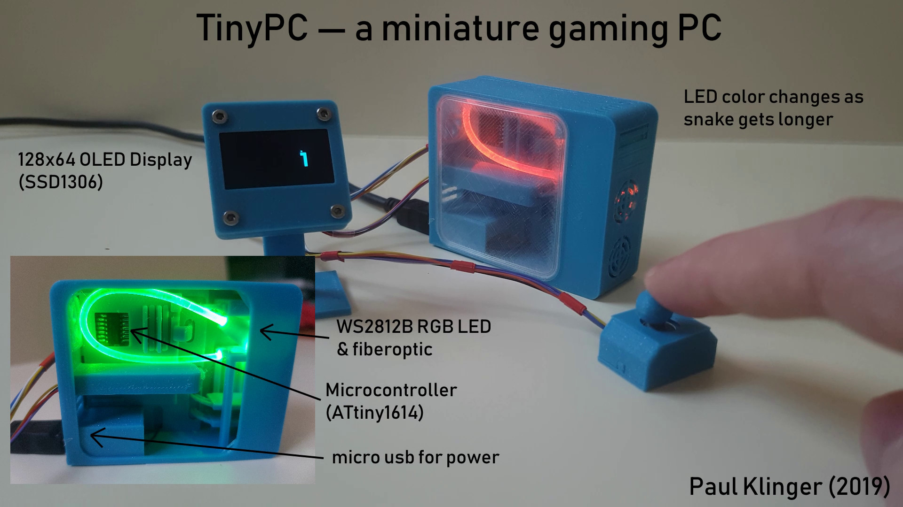

# TinyPC — A miniature gaming PC that plays snake

Components:
- [ATtiny1614 microcontroller](https://octopart.com/attiny1614-ssfr-microchip-82181131)
- [SOP14 adapter board](https://www.aliexpress.com/item/7kinds-PCB-Board-SOP8-SOP14-SOP16-SOP20-SOP24-SOP28-QFP-FQFP-TQFP-Turn-To-DIP-Adapter/32863813062.html)
- [128x64 OLED screen with SSD1306 driver](https://www.aliexpress.com/item/Free-Shipping-White-Blue-Whiteand-Blue-color-0-96-inch-128X64-OLED-Display-Module-For-arduino/32713614136.html)
- [JS5208 5 way switch](https://octopart.com/js5208-e-switch-7055822?r=sp&s=BNJOYOgrTFqksTVikSivoQ)
- [WS2812B LED](https://www.aliexpress.com/item/100pcs-DC5V-WS2812B-4Pins-5050-SMD-with-Built-in-WS2811-IC-Individually-Addressable-Digital-RGB-LED/32542036874.html)
- [2mm PMMA optic fiber](https://www.aliexpress.com/item/5mX-Transparent-side-glow-plastic-PMMA-fiber-optic-cable-solid-core-optic-cable-diameter-2mm-3mm/32807597828.html)
- micro usb breakout (I used part of a custom PCB from [an earlier project](https://github.com/PaulKlinger/satellite_tracker))
- power switch ([this one looks similar to mine](https://www.aliexpress.com/item/Promotion-50-Pcs-SS12D00G3-2-Position-SPDT-1P2T-3-Pin-PCB-Panel-Mini-Vertical-Slide-Switch/32649542037.html))

The hole in the side cover (opposite the window) is used to reprogram the MCU without dissasembling the tinypc. I use a small jig with three spring loaded pogo pins ([bought here](https://www.aliexpress.com/item/50pcs-set-New-P75-B1-Dia-1-02mm-100g-Cusp-Spear-Spring-Loaded-Test-Probes-Pogo/32767984398.html)) to connect to three pads (for power, ground, and UPDI data) in a piece of protoboard underneath (you need to put some solder in the three holes to make a surface for the pins to push against). The holes are the standard pin header ones, 0.1 inch apart, so you can just solder the pogo pins into three adjacent holes of another protoboard to make a jig. Here's [a picture](https://raw.githubusercontent.com/PaulKlinger/ndice/master/programming_jig.jpg) of the programming jig with a PICkit 4 connected (the PICkit doesn't provide power, so that comes from the usb). (I don't really recommend the pickit, the AVR support is still in beta and there are some irritating bugs.)

The window is printed using transparent PLA filament. To get it even this transparent I had to polish it a lot, using abrasive paper from 200 to 5000 grit and acrylic polishing compound.
